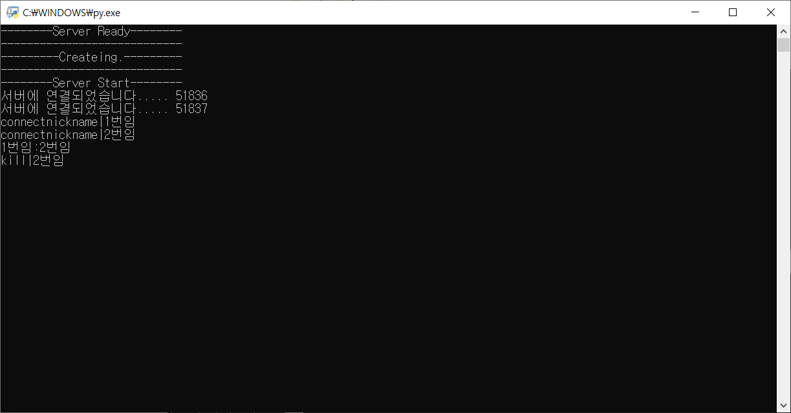

# C_201744082_배승수 | TCP/IP_기말제출

## Python_Prject

### **--개요--**

  + 수업 시간에 배운 Python 멀티 스레드를 사용하여 여러 사람이 같이 통신하는 채팅방을 구현한다.
---
### **--목적--**
  
  + 금칙어를 정한 채팅 프로그램으로써 해당 금칙어를 상대가 맞추면 클라이언트는 종료가 되도록 한다.
---
### **--설계 및 기능--**

  + 클라이언트 처음 접속 시 닉네임 설정
    + 서버에서 닉네임이 딕셔너리 형태로 소캣이랑 같이 저장된다.

  + 클라이언트의 금칙어를 정해서 다른 클라이언트가 맞추면 해당 클라이언트를 종료한다.
    + 금칙어는 클라이언트 자체에서 저장된다.
  
  + 유저가 /out을 입력시 자진해서 나갈 수도 있다.

  + 클라이언트끼리의 채팅이 원활하게 하도록 한다.

  + 소캣은 따로 배열을 두어 관리한다.

  + 클라이언트가 접속할 때마다 새로운 클라이언트가 들어왔다고 알려준다.
---
### **--차이점 등--**

  + 수업시간에 배운 내용으로는 단순히 어떤 클라이언트인지 구분도 없이 채팅을 보내는 형식이였다면 
    각 클라이언트 마다 유저 이름도 정해주어서 누가 메시지를 보내는지 알게 해주었다.
  + 각각의 클라이언트마다 금칙어를 정하게 해두어서 다른 클라이언트에서도 맞추게 된다면 
    맞춰진 클라이언트는 서버에서 종료하게 만들었다.
---
### **--구현 부분--**
  
  + **<해결>** 
    클라이언트마다 /out 입력과 금칙어를 맞추면 종료가 되지만 서버 단에서 윈도우 소캣 관련 오류가 생긴다. 
    프로그램 작동에는 이상이 없지만 신경쓰여서 관련 에러를 인터넷에서 찾아 try/except 문구를 사용하여서 
    에러 발생시 pass를 하여 해결하였다.
   
  + **<해결>** 
    해당 소캣이나 유저별로 관리하는 부분에서 파이썬을 배우지 않아서 많은 배열이나 딕셔너리 사용 등 
    많은 시행 착오를 겪었지만 여러 사이트들을 찾아보아서 사용하는 방법을 배워서 해결하였다.
---
### **--실행화면--**

  + 서버실행 부분 
    
  
  + 클라이언트 접속 
     
     
     
    
  + 서버 연결 
     
    
  + 테스트 메시지 
    + 클라이언트 부분 
     
    + 서버 부분 
     
  
  + 클라이언트의 자진 종료 
    + 클라이언트 부분 
     
    + 서버 부분 
     
    
    
  + 클라이언트의 금칙어 입력 
    + 맞춘 클라이언트 
     
    + 맞춰진 클라이언트 
     
    + 서버 부분 
     
    
